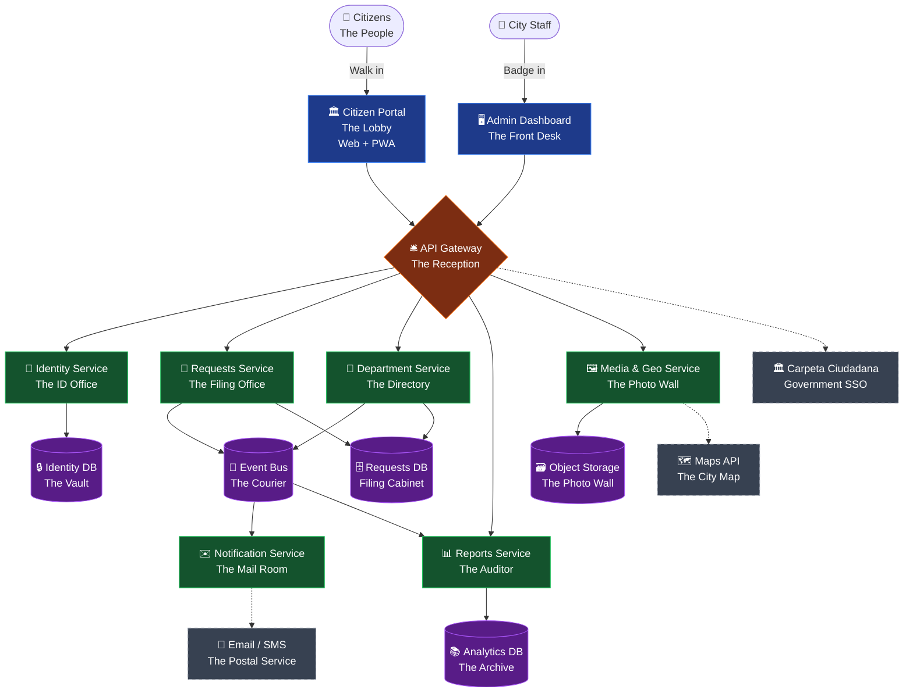
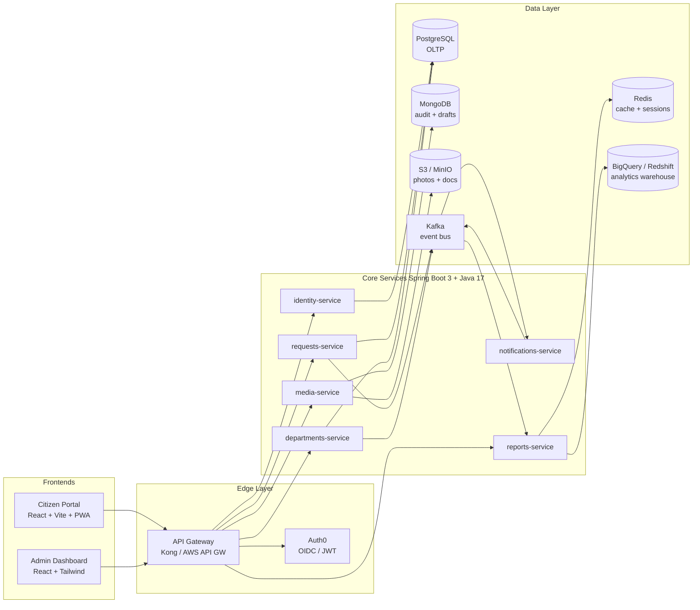
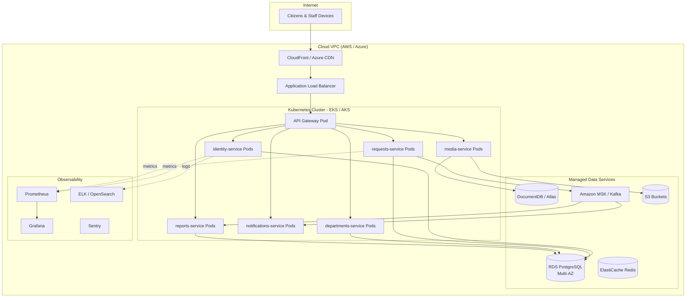
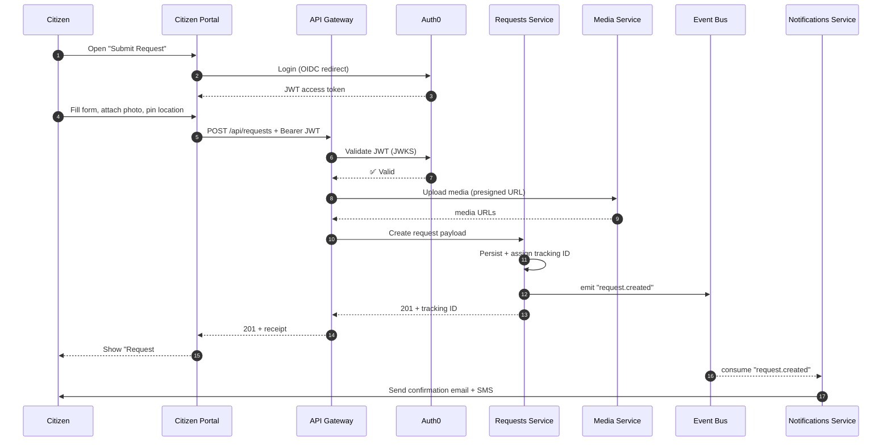
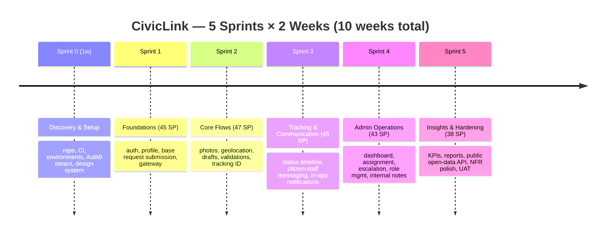
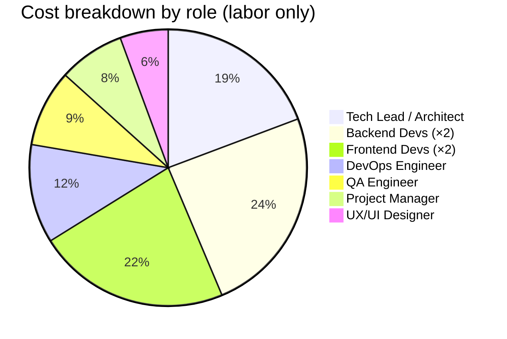

# CivicLink — Citizen Requests & Complaints Platform


---

```
   ____ _       _      _     _       _    
  / ___(_)_   _(_) ___| |   (_)_ __ | | __
 | |   | \ \ / / |/ __| |   | | '_ \| |/ /
 | |___| |\ V /| | (__| |___| | | | |   < 
  \____|_| \_/ |_|\___|_____|_|_| |_|_|\_\
              The Digital City Hall
```

> **A web-based platform that lets citizens submit, track, and resolve service requests with their local government — modeled as a Digital City Hall.**
> *Escuela Colombiana de Ingeniería Julio Garavito — Workshop: Lean (post agile) Planning and Budgeting Strategies*

This repository contains the **design, lean estimation, and budget** for CivicLink: a citizen-facing platform for managing PQRS (Peticiones, Quejas, Reclamos y Sugerencias) in a municipal government. It is delivered as a planning artifact — the architecture, prioritized backlog, and cost model are the deliverables, not running code.

---

## Quick Navigation

1. [Workshop Context](#workshop-context)
2. [The Metaphor — Digital City Hall](#the-metaphor--digital-city-hall)
3. [High-Level Architecture](#high-level-architecture)
4. [Architecture Views](#architecture-views)
5. [Tech Stack](#tech-stack)
6. [Repository Structure](#repository-structure)
7. [Product Backlog Summary](#product-backlog-summary)
8. [Sprint Plan](#sprint-plan)
9. [Development Budget Summary](#development-budget-summary)
10. [Workshop PDF](#workshop-pdf)
11. [Deliverables](#deliverables)
12. [Workshop Compliance Matrix](#workshop-compliance-matrix)
13. [Risks and Assumptions](#risks-and-assumptions)
14. [Team and Credits](#team-and-credits)

---

## Workshop Context

| Field | Value |
|---|---|
| Course | Enterprise Architectures (Arquitecturas Empresariales) |
| Workshop | Lean (post agile) Planning and Budgeting Strategies |
| Institution | Escuela Colombiana de Ingeniería Julio Garavito (ECI) |
| Team Size | 3 |
| Method | Scrum + Story Points + Velocity-based budgeting |

**Goal.** Simulate the design and decision-making challenges faced by enterprise architects in **public-sector digital transformation**: a municipal platform for citizen requests and complaints, scalable, modular, and integrable with existing public IT infrastructure.

**Deliverables required by the workshop**

1. **High-Level Design Document** with a metaphor system architecture diagram and an explanatory text → [`docs/01-high-level-design.md`](docs/01-high-level-design.md)
2. **Agile Product Backlog** as a prioritized user story map with story points → [`docs/02-product-backlog.md`](docs/02-product-backlog.md) and [`docs/04-user-story-map.md`](docs/04-user-story-map.md)
3. **Development Budget** based on team roles, hourly rates, and effort, with assumptions and ranges → [`docs/03-development-budget.md`](docs/03-development-budget.md)

---

## The Metaphor — Digital City Hall

XP's *system metaphor* practice asks us to describe the system through something concrete and shared. CivicLink is modeled as a **Digital City Hall**: every citizen interaction has a real-world counterpart in a physical municipal building, which makes the architecture intuitive for both technical and non-technical stakeholders (mayors, department heads, IT staff).

| Real City Hall | CivicLink Component | Responsibility |
|---|---|---|
| The Lobby | **Citizen Portal** (web/PWA) | Where citizens walk in, fill forms, and check status |
| The Front Desk | **Admin Dashboard** | Where staff handle, triage, and route requests |
| The Reception | **API Gateway** | Greets every visitor, validates badges, routes to the right office |
| The ID Office | **Identity Service** | Issues citizen IDs (auth) and validates credentials |
| The Filing Office | **Requests Service** | Receives, stores, and updates every PQRS file |
| The Directory | **Department Service** | Knows which office handles what, and who is on duty |
| The Mail Room | **Notification Service** | Sends confirmations, updates, and reminders by email/SMS/push |
| The Auditor's Office | **Reports & Analytics Service** | Produces KPIs, audit trails, and transparency dashboards |
| The Photo & Map Wall | **Media & Geo Service** | Stores attachments and pins requests on the city map |
| The Vault | **Identity DB (PostgreSQL)** | Citizen accounts and roles |
| The Filing Cabinet | **Requests DB (PostgreSQL)** | Requests, assignments, status history |
| The Archive | **Analytics DB (warehouse)** | Historical data for reporting |
| The Courier | **Event Bus (Kafka/RabbitMQ)** | Carries messages between offices asynchronously |
| The Postal Service | **Email/SMS Gateway** (SendGrid, Twilio) | Reaches citizens outside the building |
| The City Map | **Maps API** (Google/OSM) | Geographic context for every request |

This metaphor anchors every architectural decision: when in doubt, we ask *"how would this work in a real city hall?"*

---

## High-Level Architecture

### Metaphor View — Digital City Hall



### Why This Architecture

The platform is **modular** (each office is a microservice with a single responsibility), **scalable** (offices scale independently — the Filing Office handles peak request submissions while the Auditor's Office runs heavy analytics jobs in the background), and **integrable** (the Reception speaks REST/JSON outward, so it can plug into existing government SSO, GIS, and open-data portals without rewriting internal services).

---

## Architecture Views

### Logical View — Microservices and Data Stores



### Deployment View



### Citizen Request — Sequence View



---

## Tech Stack

| Layer | Technology | Why |
|---|---|---|
| **Citizen Portal** | React 18 + Vite + Tailwind CSS + PWA | Mobile-first, offline-ready for low-connectivity citizens |
| **Admin Dashboard** | React 18 + shadcn/ui + Recharts | Rich data tables, KPIs, role-based UI |
| **API Gateway** | Kong / AWS API Gateway | Routing, rate limiting, JWT validation, CORS |
| **Identity** | Auth0 (OIDC + RS256 JWT) | Production-ready IdP, social + government SSO |
| **Backend services** | Spring Boot 3.2 + Java 17 | Mature ecosystem, team familiarity, strong typing |
| **Inter-service comms** | REST (sync) + Kafka (async events) | CQRS-friendly, decouples notifications and reporting |
| **OLTP database** | PostgreSQL 16 (RDS Multi-AZ) | ACID, geospatial via PostGIS |
| **Document store** | MongoDB (audit log, drafts) | Flexible schema for varying request types |
| **Cache** | Redis | Session, rate limit, hot-list cache |
| **Object storage** | Amazon S3 / MinIO | Photos, attachments, exports |
| **Analytics warehouse** | BigQuery / Redshift | Long-term reporting and KPIs |
| **Maps** | Google Maps Platform / OpenStreetMap | Pin requests by lat/lon, heatmaps |
| **Notifications** | SendGrid (email), Twilio (SMS), FCM (push) | Reliable, well-documented gateways |
| **Containers** | Docker + Kubernetes (EKS/AKS) | Independent service scaling |
| **CI/CD** | GitHub Actions + Argo CD | GitOps, repeatable, auditable |
| **Observability** | Prometheus + Grafana + ELK + Sentry | Metrics, logs, errors |
| **Quality** | JUnit 5, Mockito, Cypress, k6, SonarCloud | Unit, e2e, load, code quality |
| **Project mgmt** | Jira + Confluence | Backlog, sprints, docs |

---

## Repository Structure

```
civic-requests-platform/
├── README.md                          ← this file (showcase + index)
├── LICENSE
├── .gitignore
│
├── docs/
│   ├── 01-high-level-design.md        ← Deliverable 1: HLD with metaphor + text
│   ├── 02-product-backlog.md          ← Deliverable 2: epics + user stories + SP
│   ├── 03-development-budget.md       ← Deliverable 3: budget, rates, assumptions
│   ├── 04-user-story-map.md           ← User story mapping (supporting artifact)
│   └── diagrams/
│       └── (exports of mermaid diagrams as PNG/SVG, optional)
│
└── (no source code — this is a planning workshop)
```

---

## Product Backlog Summary

The full backlog with acceptance criteria lives in [`docs/02-product-backlog.md`](docs/02-product-backlog.md). Snapshot:

| # | Epic | Stories | Story Points | Priority |
|---|---|---|---|---|
| E1 | Citizen Onboarding & Authentication | 6 | **21** | Must |
| E2 | Request Submission | 8 | **34** | Must |
| E3 | Request Tracking | 6 | **21** | Must |
| E4 | Communication | 4 | **16** | Should |
| E5 | Admin Operations | 8 | **39** | Must |
| E6 | Reports & Analytics | 5 | **26** | Should |
| E7 | Notifications | 4 | **16** | Should |
| E8 | Integrations | 4 | **21** | Could |
| E9 | Platform & Quality (NFR) | 6 | **24** | Must |
| | **TOTAL** | **51** | **218 SP** | |

Estimation scale: **Fibonacci** (1, 2, 3, 5, 8, 13). Estimates by **Planning Poker** with the team. Stories larger than 13 SP are split before entering a sprint.

---

## Sprint Plan



**Velocity assumption.** Once the team stabilises (after Sprint 1), expected velocity is **~45 SP/sprint** for a team of 6 developers (FE×2 + BE×2 + DevOps + Tech Lead). With 218 SP backlog and contingency, **5 sprints** (10 weeks) is the planned envelope.

---

## Development Budget Summary

The detailed model with assumptions, ranges, and sensitivity lives in [`docs/03-development-budget.md`](docs/03-development-budget.md). Headlines:

| Cost Category | Amount (USD) |
|---|---|
| Labor (7 roles, 10 weeks) | **$124,600** |
| Tools & licenses | $4,650 |
| Equipment & onboarding | $2,000 |
| Cloud infra (dev + staging) | included in tools |
| Contingency (15%) | $19,688 |
| **Estimated total (point)** | **$150,938** |
| **Range (P10 – P90)** | **$128,000 – $174,000** |

Equivalent in COP at an indicative rate of 1 USD ≈ 4,200 COP: ~**COP 634 M** (range COP 538 M – 731 M).



---

## Workshop PDF

Open the full compiled workshop document here:

- [CivicLink Workshop PDF](docs/civiclink-workshop.pdf)

---

## Deliverables

| # | Deliverable | File | Status |
|---|---|---|---|
| 1 | High-Level Design Document (metaphor diagram + explanatory text) | [`docs/01-high-level-design.md`](docs/01-high-level-design.md) | ✅ |
| 2 | Agile Product Backlog (epics, user stories, story points, prioritization) | [`docs/02-product-backlog.md`](docs/02-product-backlog.md) | ✅ |
| 3 | User Story Map (supporting structure for the backlog) | [`docs/04-user-story-map.md`](docs/04-user-story-map.md) | ✅ |
| 4 | Development Budget (roles, rates, effort, assumptions, ranges) | [`docs/03-development-budget.md`](docs/03-development-budget.md) | ✅ |

---

## Workshop Compliance Matrix

| Workshop Requirement | How CivicLink Addresses It | Where to Find It |
|---|---|---|
| Web-based platform for citizen requests in a municipal government | CivicLink Citizen Portal + Admin Dashboard | HLD §2, §3 |
| Submit service requests (lighting, waste, infrastructure) | E2: Request Submission, with category taxonomy | Backlog E2 |
| Track status of requests | E3: Request Tracking with status timeline + tracking ID | Backlog E3 |
| Communicate with local authorities | E4: Communication (citizen ⇄ staff messaging) | Backlog E4 |
| Admins assign requests to departments | E5 / US-27 with department service | Backlog E5 |
| Monitor resolution times | E6 / US-33 KPI dashboard with avg resolution time | Backlog E6 |
| Generate performance reports | E6 / US-34, US-36 (PDF/Excel export) | Backlog E6 |
| Scalability, modularity | Microservices on K8s, Kafka decoupling, stateless services | HLD §4, §5 |
| Integration with public IT infrastructure | E8: Government SSO (Carpeta Ciudadana), GIS, public open-data API | Backlog E8 |
| Lean estimation techniques | Fibonacci story points + Planning Poker + velocity-based forecast | Backlog §1, Budget §3 |
| Development budget by roles, timelines, tech costs | Detailed model in dollars with ranges and assumptions | Budget §4–§7 |
| Architecture modeling tool (Draw.io / Lucidchart / diagrams.net) | Mermaid diagrams (renderable on GitHub, exportable) | README + HLD |
| Spreadsheet / cost modeling | Markdown tables (reproducible in Excel/Sheets) | Budget §4 |
| Metaphor system architecture diagram | "Digital City Hall" metaphor with metaphor → component map | HLD §2, README §3 |
| User story mapping | Map by user backbone × release slices | `04-user-story-map.md` |

---

## Risks and Assumptions

The full register is in the budget document. Most material:

| ID | Risk / Assumption | Mitigation / Buffer |
|---|---|---|
| R1 | Government SSO integration takes longer than estimated | Treated as Could; isolated in Sprint 5; +5 SP buffer |
| R2 | Velocity for first sprint will be ~70% of stable velocity | Sprint 1 planned at 45 SP, not the full capacity of 60 |
| R3 | Hourly rates assume Colombian market in 2026 | Range column gives ±15% sensitivity |
| R4 | Cloud costs assume dev + staging only (production is operations, not project) | Budget excludes prod ops; mentioned explicitly |
| R5 | Auth0 free tier is enough for development; production needs Essentials | Tools line includes Auth0 paid plan |
| R6 | Photo storage volume estimated at 10 GB during build phase | S3 cost negligible; revisit at scale |
| R7 | Team is co-located in Bogotá or fully remote with overlap | No travel costs assumed |
| R8 | Workshop deliverable is the *plan*, not the running system | Repo contains design + estimation only |

---

## Team and Credits

| Role | Name | GitHub |
|---|---|---|
| Member — Architecture & DevOps lead | Andersson David Sánchez Méndez | [AnderssonProgramming](https://github.com/AnderssonProgramming) |
| Member — Backend & Microservices | Cristian Santiago Pedraza Rodríguez | [cris-eci](https://github.com/cris-eci) |
| Member — ML / Mobile / Observability | Raquel Iveth Selma Ayala | [RaquelSAyala](https://github.com/RaquelSAyala) |

---

## License

This project is licensed under the [MIT License](LICENSE).