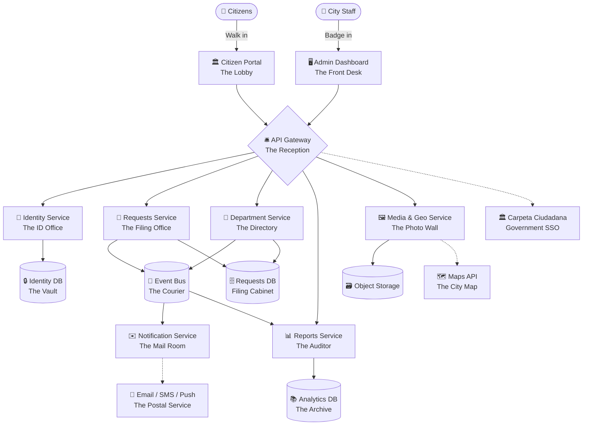
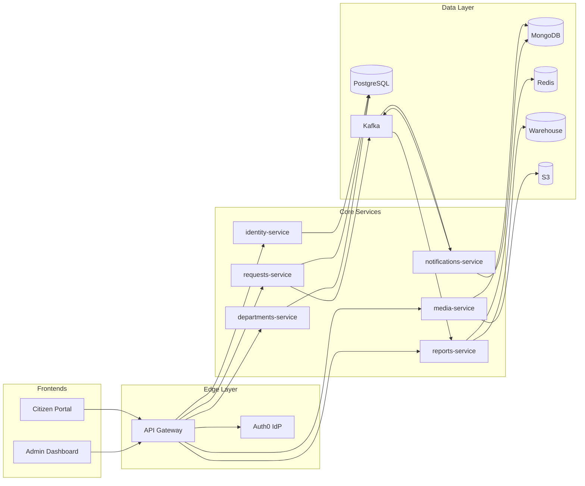
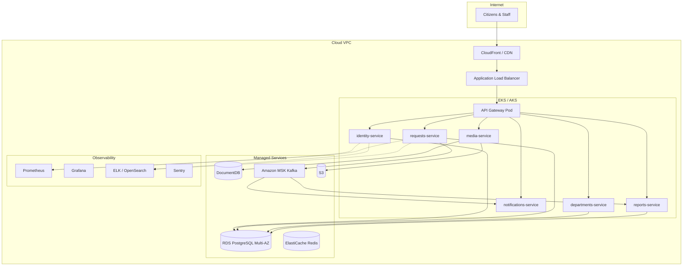

# Deliverable 1 — High-Level Design Document

**Project:** CivicLink — Citizen Requests & Complaints Platform
**Workshop:** Lean (post agile) Planning and Budgeting Strategies
**Course:** Enterprise Architectures — ECI
**Authors:** Andersson D. Sánchez M., Cristian S. Pedraza R., Jeisson D. Sánchez G.

---

## 1. Executive Summary

CivicLink is a web-based platform that lets citizens of a mid-sized Colombian municipality submit, track, and resolve service requests (PQRS) — public lighting outages, missed waste collection, damaged infrastructure, noise complaints, and similar — and lets municipal staff assign, work, and report on those requests. The architecture is **microservices-based, event-driven, cloud-native, and integrable with the existing public IT stack** (government SSO, GIS, open-data portals).

This document describes the system through the **Digital City Hall metaphor** (Section 2), then formalises it into a high-level architecture (Sections 3–6) with views for stakeholders.

---

## 2. The System Metaphor — Digital City Hall

XP's **system metaphor** is a shared story that helps everyone — developers, mayors, citizens — talk about the system using the same vocabulary. CivicLink is a **Digital City Hall**: every interaction has a counterpart in a real municipal building.

A citizen walks into the **Lobby** (Citizen Portal), is greeted at the **Reception** (API Gateway), shows their **ID** at the ID Office (Identity Service), files their request at the **Filing Office** (Requests Service), and gets a receipt in the **Mail Room** (Notification Service). City staff enter through the **Front Desk** (Admin Dashboard), consult the **Directory** (Department Service) to know who handles what, and the **Auditor's Office** (Reports Service) tells the mayor how the building is performing.

Why this metaphor works:

- **Concreteness.** Every component has a physical counterpart, which makes design conversations grounded.
- **Modularity by analogy.** Real city halls are organised by department, each with its own files and staff — that maps naturally to microservices.
- **Resilience by analogy.** If the Mail Room is overloaded, the Filing Office still works — exactly how an event-driven architecture isolates failures.
- **Onboarding.** New developers, designers, and even non-technical product owners can reason about the system within minutes.

### 2.1 Metaphor → Component Mapping

| Real City Hall | CivicLink Component | Technology | Single Responsibility |
|---|---|---|---|
| The Lobby | Citizen Portal | React + Vite + Tailwind, PWA | Public-facing UI for citizens |
| The Front Desk | Admin Dashboard | React + shadcn/ui + Recharts | Internal UI for staff and admins |
| The Reception | API Gateway | Kong / AWS API Gateway | Routing, JWT validation, rate limiting, CORS |
| The ID Office | Identity Service | Auth0 + Spring Boot facade | Auth, profiles, roles |
| The Filing Office | Requests Service | Spring Boot + PostgreSQL | CRUD + lifecycle of requests |
| The Directory | Department Service | Spring Boot + PostgreSQL | Departments, staff, assignment rules |
| The Mail Room | Notification Service | Spring Boot + SendGrid + Twilio + FCM | Email, SMS, push, in-app |
| The Auditor's Office | Reports & Analytics Service | Spring Boot + BigQuery/Redshift | KPIs, dashboards, exports |
| The Photo Wall | Media & Geo Service | Spring Boot + S3 + Maps API | Photos, attachments, geocoding |
| The Courier | Event Bus | Apache Kafka (MSK) | Async messages between services |
| The Vault | Identity DB | PostgreSQL (managed) | Citizen credentials and roles |
| The Filing Cabinet | Requests DB | PostgreSQL + PostGIS | Requests, assignments, status history |
| The Archive | Analytics Warehouse | BigQuery / Redshift | Historical reporting data |
| The Postal Service | Email/SMS/Push Gateways | SendGrid, Twilio, FCM | External delivery channels |
| The City Map | Maps Provider | Google Maps / OpenStreetMap | Geocoding, tiles, heatmaps |

### 2.2 Metaphor Diagram

---

## 3. Architectural Drivers

The architecture is shaped by these quality attributes (in priority order):

| # | Driver | Concrete Target | How the Architecture Addresses It |
|---|---|---|---|
| 1 | **Availability** | 99.5% on Citizen Portal, 99.9% on submission flow | Multi-AZ PostgreSQL, stateless services, event-driven decoupling |
| 2 | **Modularity** | Independent deployability of every service | Microservices, contract-first APIs, separate repos or monorepo with isolated CI |
| 3 | **Scalability** | 5,000 concurrent citizens, 500 requests/min peak | Horizontal pod autoscaling, Redis cache, Kafka buffering |
| 4 | **Security** | OWASP Top 10, GDPR/Habeas Data, audit trail | OIDC + RS256 JWT, encryption at rest/in transit, immutable audit log in MongoDB |
| 5 | **Integrability** | Open data API, government SSO, GIS layer | Public REST + OpenAPI, OIDC federation, webhook-based integrations |
| 6 | **Observability** | Mean time to detect < 5 min | Prometheus metrics, ELK logs, Sentry errors, distributed tracing (OpenTelemetry) |
| 7 | **Accessibility** | WCAG 2.1 AA on Citizen Portal | Semantic HTML, ARIA, keyboard nav, screen-reader testing |
| 8 | **Cost-efficiency** | Cloud bill < USD 1,500/month at MVP scale | PAY_PER_REQUEST DynamoDB-style services where possible, autoscale to zero on dev |

---

## 4. Logical Architecture

### 4.1 Service Catalog

| Service | Responsibility | Storage | Sync API | Async (events emitted / consumed) |
|---|---|---|---|---|
| identity-service | Authn, authz, profiles | PostgreSQL (users, roles) | `/auth/*`, `/me`, `/users/*` | emits `user.created`, `user.updated` |
| requests-service | Requests lifecycle | PostgreSQL + PostGIS | `/requests/*`, `/stream` | emits `request.created`, `request.statusChanged`, `request.assigned` |
| departments-service | Departments, staff, rules | PostgreSQL | `/departments/*`, `/assignments/*` | consumes `request.created` to auto-assign |
| media-service | Photos, attachments, geocoding | S3 + MongoDB metadata | `/media/upload`, `/media/{id}` | — |
| notifications-service | Email, SMS, push, in-app | MongoDB (delivery log) | `/notifications/me` | consumes `request.*`, `user.created` |
| reports-service | KPIs, dashboards, exports | Warehouse + Redis | `/reports/*`, `/kpis/*` | consumes all `request.*` events for ETL |

### 4.2 Logical Diagram

---

## 5. Deployment Architecture

CivicLink runs on a **Kubernetes** cluster (EKS or AKS) inside a single cloud VPC, with managed data services and a CDN at the edge.

### 5.1 Environments

| Environment | Purpose | Data | Cost band |
|---|---|---|---|
| `dev` | Daily development, ephemeral | Synthetic | $300/month |
| `staging` | UAT, performance, security tests | Anonymised production-like | $700/month |
| `prod` (out of project scope) | Live citizens | Real | budget separately as ops |

---

## 6. Cross-Cutting Concerns

### 6.1 Security

- **Authentication.** OIDC + RS256 JWT issued by Auth0; tokens validated by every service via JWKS.
- **Authorization.** Role-based: `citizen`, `staff`, `dept-head`, `admin`, `auditor`. Enforced at the gateway and re-checked at each service.
- **Transport.** TLS 1.2+ everywhere. Certificates managed by ACM/Let's Encrypt.
- **At rest.** AES-256 on RDS, S3, EBS volumes. Photos uploaded via presigned URLs.
- **Audit.** Every state change appended to an immutable MongoDB collection.
- **Data privacy.** GDPR / Colombian *Habeas Data* (Ley 1581) — citizens can export and delete their data; PII minimised in logs.
- **OWASP.** Standard mitigations: parameterised queries, input validation, output encoding, CSP headers, dependency scanning in CI.

### 6.2 Observability

- **Metrics.** Prometheus scrapes every service; Grafana dashboards per microservice.
- **Logs.** Structured JSON, shipped to ELK/OpenSearch.
- **Traces.** OpenTelemetry SDK; traces in Jaeger.
- **Errors.** Sentry for frontend and backend, alerting via Slack and PagerDuty.

### 6.3 CI/CD

- **GitHub Actions** per service: build → unit test → SonarCloud → container build → vulnerability scan → push to ECR → deploy to dev.
- **Argo CD** for GitOps deployments to staging and prod.
- **Conventional commits**, no `var`, named functions, named constants, magic strings forbidden — enforced by lint and code review.

### 6.4 Integration with Existing Public IT

| External system | Integration | Direction |
|---|---|---|
| Carpeta Ciudadana Digital (Colombian gov SSO) | OIDC federation | Citizens log in with their government account |
| Municipal GIS layer | REST consumption + map overlay | Read public lighting / waste routes |
| Open Data Portal | Public REST API + nightly CSV dump | Outbound transparency |
| Internal HR system | SCIM / nightly batch | Sync municipal staff into Identity Service |
| Existing waste-management contractor | Outbound webhooks | Notify contractors of new pickup requests |

---

## 7. Trade-offs and Architectural Decisions

| ADR | Decision | Rationale |
|---|---|---|
| ADR-01 | Microservices over monolith | Independent scaling per office, parallelisable team work, public-sector procurement often replaces individual modules over time |
| ADR-02 | Kafka over synchronous REST for notifications | Decouples slow gateways (SMS, email) from the user-facing submit flow; resilience |
| ADR-03 | PostgreSQL as primary OLTP | Mature, supports PostGIS for geolocation, lower cost than DynamoDB for relational workloads |
| ADR-04 | Auth0 over self-hosted Keycloak | Faster time-to-market, managed JWKS rotation, social login built-in; revisit at scale |
| ADR-05 | React + Vite + PWA over native mobile | One codebase, offline-capable for low-connectivity neighborhoods, much lower cost |
| ADR-06 | Mermaid for diagrams (not Draw.io binaries) | Diagrams as code, reviewable in PRs, render natively on GitHub |

---

## 8. Glossary

- **PQRS** — *Petición, Queja, Reclamo o Sugerencia*. The Colombian legal category that this platform serves.
- **Citizen** — End user, resident of the municipality.
- **Staff** — Municipal employee handling requests.
- **Tracking ID** — Public, opaque code (`PQRS-2026-00042`) for following a request without an account.
- **SSO** — Single Sign-On; here usually the Colombian *Carpeta Ciudadana Digital*.
- **Story Point (SP)** — Relative effort unit, Fibonacci scale.
- **Velocity** — Story points completed per sprint, averaged over recent sprints.