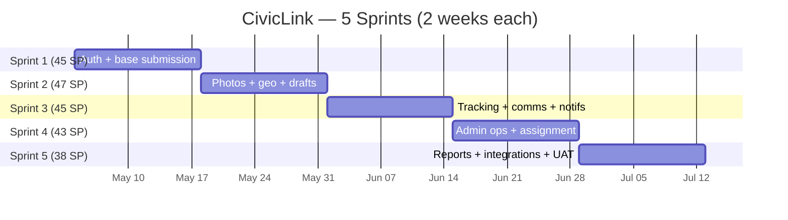

# Deliverable 2 — Agile Product Backlog

**Project:** CivicLink
**Estimation method:** Planning Poker, Fibonacci scale (1, 2, 3, 5, 8, 13)
**Total backlog:** 218 SP across 51 user stories in 9 epics
**Velocity assumption:** ~45 SP per 2-week sprint (steady-state)
**Planned envelope:** 5 sprints (10 weeks)

---

## 1. Story-Point Reference Stories

So estimates stay grounded, the team agreed on these references:

| SP | Reference Story | Why |
|---|---|---|
| 1 | "Add a static About page" | No backend, no validation |
| 2 | "Add a 'remember me' checkbox to login" | Trivial frontend + minor backend tweak |
| 3 | "Profile edit form (name, phone)" | Form + validation + 1 endpoint |
| 5 | "Email-based password reset" | Multi-step flow, email integration |
| 8 | "Pin a request location on a map with reverse geocoding" | New library, geo logic, mobile UX |
| 13 | "Real-time admin dashboard with live KPIs" | WebSockets + warehouse query + visualisation |

Anything **>13 SP** is split before being committed to a sprint.

---

## 2. MoSCoW Prioritization

- **Must** — without this, the platform cannot replace the manual PQRS process.
- **Should** — strongly expected, but the system can launch without it for one cycle.
- **Could** — nice to have, scheduled if velocity allows.
- **Won't (this release)** — scoped out explicitly to control budget.

---

## 3. Epics Overview

| ID | Epic | Stories | SP | MoSCoW |
|---|---|---|---|---|
| E1 | Citizen Onboarding & Authentication | 6 | 21 | Must |
| E2 | Request Submission | 8 | 34 | Must |
| E3 | Request Tracking | 6 | 21 | Must |
| E4 | Communication | 4 | 16 | Should |
| E5 | Admin Operations | 8 | 39 | Must |
| E6 | Reports & Analytics | 5 | 26 | Should |
| E7 | Notifications | 4 | 16 | Should |
| E8 | Integrations | 4 | 21 | Could |
| E9 | Platform & Quality (NFR) | 6 | 24 | Must |
| | **Total** | **51** | **218** | |

---

## 4. Detailed Backlog

### Epic E1 — Citizen Onboarding & Authentication (21 SP)

| ID | User Story | SP | Priority |
|---|---|---|---|
| US-01 | As a **citizen**, I want to **register an account with email and password** so that **I can submit and track requests**. | 5 | Must |
| US-02 | As a **citizen**, I want to **log in with email/password** so that **I can access my dashboard**. | 3 | Must |
| US-03 | As a **citizen**, I want to **log in with Google** so that **I avoid creating yet another password**. | 5 | Must |
| US-04 | As a **citizen**, I want to **recover my password by email** so that **I can regain access if I forget it**. | 3 | Must |
| US-05 | As a **citizen**, I want to **edit my profile (name, phone, address)** so that **the city has accurate contact info**. | 3 | Must |
| US-06 | As a **citizen**, I want to **verify my email** so that **my account is trustworthy**. | 2 | Must |

**Acceptance criteria sample (US-01).** Given a new visitor, when they submit a valid email and password (≥8 chars, 1 number, 1 symbol), then a confirmation email is sent and the account is in `pending_verification` until clicked. Existing emails return 409.

---

### Epic E2 — Request Submission (34 SP)

| ID | User Story | SP | Priority |
|---|---|---|---|
| US-07 | As a **citizen**, I want to **submit a request with a title and description** so that **the city knows what to fix**. | 5 | Must |
| US-08 | As a **citizen**, I want to **pick a category** (lighting, waste, infrastructure, noise, other) so that **the right department gets it**. | 3 | Must |
| US-09 | As a **citizen**, I want to **attach up to 5 photos** so that **staff see the actual issue**. | 5 | Must |
| US-10 | As a **citizen**, I want to **pin the location on a map** so that **staff find it quickly**. | 8 | Must |
| US-11 | As a **citizen**, I want to **submit anonymously for sensitive issues** so that **I'm not exposed**. | 5 | Should |
| US-12 | As a **citizen**, I want to **save a draft** so that **I can finish later**. | 3 | Should |
| US-13 | As a **citizen**, I want **inline form validation** so that **I know what's missing before I submit**. | 2 | Must |
| US-14 | As a **citizen**, I want **a tracking ID receipt** (e.g. `PQRS-2026-00042`) so that **I can follow up without an account**. | 3 | Must |

---

### Epic E3 — Request Tracking (21 SP)

| ID | User Story | SP | Priority |
|---|---|---|---|
| US-15 | As a **citizen**, I want to **see all my requests in a list** so that **I have one place to look**. | 3 | Must |
| US-16 | As a **citizen**, I want to **see the current status of each request** (submitted, in review, in progress, resolved, closed) so that **I know where it stands**. | 3 | Must |
| US-17 | As a **citizen**, I want to **view the full timeline of a request** so that **I see every step taken**. | 5 | Must |
| US-18 | As a **citizen**, I want to **see which department and staff member is handling my case** so that **I know who's responsible**. | 2 | Should |
| US-19 | As a **citizen**, I want to **track a request via a public link with the tracking ID** so that **I don't always need to log in**. | 5 | Must |
| US-20 | As a **citizen**, I want to **filter and search my requests** so that **I find the one I care about**. | 3 | Should |

---

### Epic E4 — Communication (16 SP)

| ID | User Story | SP | Priority |
|---|---|---|---|
| US-21 | As a **citizen**, I want to **send messages to staff about my request** so that **I can clarify or add info**. | 5 | Should |
| US-22 | As **staff**, I want to **reply to citizens through the platform** so that **conversation history is preserved**. | 5 | Should |
| US-23 | As a **citizen**, I want to **be alerted when staff replies** so that **I respond promptly**. | 3 | Should |
| US-24 | As a **citizen**, I want to **rate the resolution after closing** so that **the city improves**. | 3 | Should |

---

### Epic E5 — Admin Operations (39 SP)

| ID | User Story | SP | Priority |
|---|---|---|---|
| US-25 | As an **admin**, I want a **dashboard listing all open requests** so that **I see the full operational load**. | 5 | Must |
| US-26 | As an **admin**, I want to **filter by department, urgency, location, and status** so that **I focus on what's relevant**. | 5 | Must |
| US-27 | As a **department head**, I want to **assign requests to specific staff** so that **work is distributed fairly**. | 8 | Must |
| US-28 | As **staff**, I want to **update the status of my requests** so that **citizens see progress**. | 3 | Must |
| US-29 | As **staff**, I want to **add internal notes invisible to citizens** so that **the team coordinates**. | 3 | Must |
| US-30 | As an **admin**, I want **overdue requests automatically escalated** so that **nothing rots silently**. | 5 | Must |
| US-31 | As an **admin**, I want to **manage department configurations** (name, area, SLA, auto-assignment rules) so that **the org evolves without code changes**. | 5 | Must |
| US-32 | As an **admin**, I want to **manage roles and permissions** so that **access matches responsibility**. | 5 | Must |

---

### Epic E6 — Reports & Analytics (26 SP)

| ID | User Story | SP | Priority |
|---|---|---|---|
| US-33 | As an **admin**, I want a **KPI dashboard** (open requests, avg resolution time, SLA compliance, satisfaction) so that **I run the city by data**. | 8 | Should |
| US-34 | As an **admin**, I want **per-department performance reports** so that **I identify bottlenecks**. | 5 | Should |
| US-35 | As an **admin**, I want **request distribution maps and charts** by category and zone so that **I plan resources**. | 5 | Should |
| US-36 | As an **admin**, I want to **export reports to PDF and Excel** so that **I share them with the council**. | 3 | Should |
| US-37 | As a **citizen / journalist**, I want a **public transparency dashboard** so that **the city is held accountable**. | 5 | Should |

---

### Epic E7 — Notifications (16 SP)

| ID | User Story | SP | Priority |
|---|---|---|---|
| US-38 | As a **citizen**, I want **email notifications on every status change** so that **I'm informed**. | 5 | Should |
| US-39 | As a **citizen**, I want **SMS notifications for urgent updates** so that **I don't miss them**. | 5 | Should |
| US-40 | As a **citizen**, I want **in-app notifications** so that **I see updates next time I open the portal**. | 3 | Should |
| US-41 | As a **citizen**, I want to **manage notification preferences** so that **I'm not spammed**. | 3 | Should |

---

### Epic E8 — Integrations (21 SP)

| ID | User Story | SP | Priority |
|---|---|---|---|
| US-42 | As a **citizen**, I want to **log in with Carpeta Ciudadana Digital** (Colombian government SSO) so that **I reuse my official identity**. | 8 | Could |
| US-43 | As an **admin**, I want **the platform to consume the municipal GIS layer** of public lighting so that **requests are validated against the network**. | 5 | Could |
| US-44 | As a **journalist / developer**, I want **a public REST API** so that **open data is consumable**. | 5 | Could |
| US-45 | As an **admin**, I want **outbound webhooks to external contractors** so that **partners are auto-notified**. | 3 | Could |

---

### Epic E9 — Platform & Quality / NFR (24 SP)

| ID | User Story | SP | Priority |
|---|---|---|---|
| US-46 | As **DevOps**, I want **CI/CD pipelines per service** so that **deployments are automated and auditable**. | 5 | Must |
| US-47 | As **DevOps**, I want **centralised metrics, logs, and traces** so that **incidents are diagnosable**. | 5 | Must |
| US-48 | As a **security officer**, I want **OWASP Top-10 mitigations and dependency scanning** so that **the platform stays safe**. | 5 | Must |
| US-49 | As a **developer**, I want **feature flags** so that **risky changes ship safely**. | 3 | Should |
| US-50 | As a **citizen**, I want **a fully mobile-friendly PWA** so that **I use the platform from any phone**. | 3 | Must |
| US-51 | As an **accessibility advocate**, I want **WCAG 2.1 AA compliance** so that **every citizen is included**. | 3 | Must |

---

## 5. Sprint Distribution

| Sprint | Stories included | SP |
|---|---|---|
| 1 | US-01, US-02, US-04, US-06, US-07, US-08, US-13, US-14, US-46, US-50 | 30 + buffered NFR |
| 1 (planned) | … reaches **45 SP** by adding US-03 (5) and US-25 (5) | **45** |
| 2 | US-09, US-10, US-11, US-12, US-15, US-16, US-26 | **47** |
| 3 | US-17, US-19, US-20, US-21, US-22, US-23, US-38, US-39, US-40 | **45** |
| 4 | US-27, US-28, US-29, US-30, US-31, US-32, US-05, US-18 | **43** |
| 5 | US-33, US-34, US-35, US-36, US-37, US-24, US-41, US-47, US-48, US-49, US-51 | **38** |

The **Could** epic (E8) is deliberately *not* committed to a sprint; it is funded by leftover velocity and an explicit 5 SP buffer in Sprint 5. If velocity beats expectations, US-42 → US-45 are pulled in.

---

## 6. Definition of Ready (DoR)

A story enters a sprint only when:

1. INVEST criteria met (Independent, Negotiable, Valuable, Estimable, Small, Testable).
2. Acceptance criteria written in Given/When/Then.
3. UX mockup attached if UI-touching.
4. ≤ 13 SP.
5. Dependencies identified and unblocked.

## 7. Definition of Done (DoD)

A story is **done** when:

1. Code merged to `main` via PR with at least one approval.
2. Unit + integration tests passing, coverage ≥ 80%.
3. Lint and SonarCloud quality gate green.
4. Deployed to `dev` and smoke-tested.
5. Documentation (README, ADR, API docs) updated.
6. Demo'd in sprint review and accepted by Product Owner.